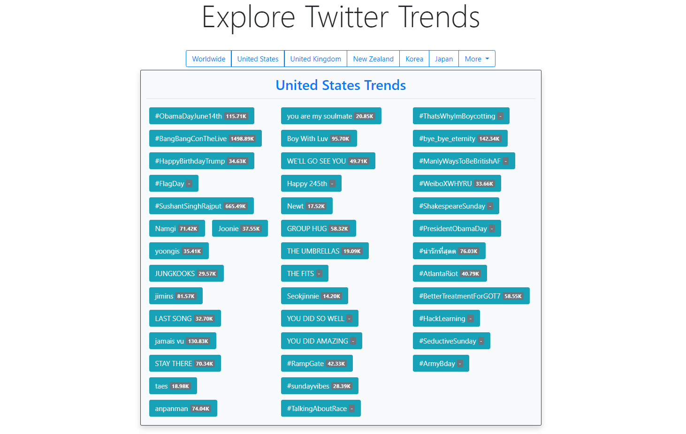

# Twitter Trends Explorer!

Explore Twitter Trends in various locations and peek at some of the popular tweets in that trend.#Twitter Trends Explorer




## About this app
Twitter doesn't make it easy to look at trends from other cities and countries, and the top 10 trending shown on Twitter isn't always 
indicative of the trends with the most tweets. This app solves both these issues.

For starters, you can pick any of the countries supported by Twitter and get all the trending data from that location.
After that you can peek at some of the popular tweets whithin that trend with just a click.

## Twitter API
The Twitter API imposes rate limitation on all apps so requesting the trending data every time a user wants it is impractical.
To combat that, this app has minimal interaction with the Twitter API to avoid the risk of throttling.
Trends are cached for 4 hours by default, so if the location has been requested in the last 4 hours no additional requests are made to Twitter.

Additionally, the tweets are searched using a scraping library called [twint](https://github.com/twintproject/twint) so no calls made to the Twitter API there whatsoever.

This app uses the `tweepy` python wrapper for the Twitter API.

## TODO
I would like to make the site look better. As it is, it looks super plain. Also, it needs to be made mobile responsive.

## Setup
Add a `auth.json` file to the project directory and add in your Twitter API keys: Consumer key, Consumer secret.
The file should look like so:

```python
{
    "API_KEY": "insert_key_here",
    "API_SECRET": "insert_secret_here"

}
```